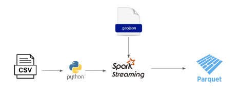
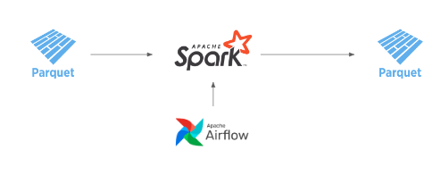

# Taxi NYC - Data Project 
O objetivo do exercício não é avaliar a melhor performance, mas entender como você estrutura, organiza e apresenta a solução de um problema.
Neste case, você precisa implementar uma solução que:
- Tenha como base o dataset: https://www.kaggle.com/competitions/new-york-city-taxi-fare-prediction/data (arquivo train.csv)

- Tenha uma aplicação streaming que produza eventos baseados no dataset citado acima (podendo usar por exemplo: flask-sse)

- Tenha uma aplicação que consuma os eventos com a possibilidade de filtros por data e local da corrida

- Armazene os resultados em formato Parquet

- Estruture um datalake para que seja possível consolidar dados analíticos por data/horário da corrida (ou local) e posteriormente consultar informações coletadas de forma batch 

Como sugestão, você poderia usar:

-  Kafka, RabbitMQ, Server Side Events para criar o canal de streaming que irá fomentar a aplicação.

-  Spark com Scala - Para extração, escrita e consolidação

- Airflow – Orquestração do processamento

- Docker / Compose – Para deploy da aplicação

Tópicos que consideramos relevantes:

- Testes unitários

- Desenho de solução

- Estrutura de código / Boas práticas de Software Engineering e Data Engineering

- Aplicação up and running

  
## Neste projeto foi utilizado as seguintes tecnologias open source:
- [Docker](https://www.docker.com)
- [Airflow](https://airflow.apache.org) 
- [Spark](https://spark.apache.org)  
- [Uber H3](https://h3geo.org/)

geojson da cidade de Nova york - 
https://data.cityofnewyork.us/Transportation/NYC-Taxi-Zones/d3c5-ddgc

## Arquitetura

### ingestão Streaming

### Transformação em batch

 
 
 